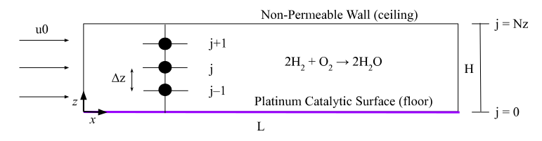

# 1D and 2D Flow Through a Reactor with Catalytic Surface Chemistry
### Kento Abeywardane
#### Professor Goldsmith
##### ENGN 2910Q - Chemically Reacting Flow
##### Brown University 

#
## Project Overview
This project concerns the Hydrogen-Oxygen (H2/O2) combustion system
as it flows through a 1D plug flow reactor (PFR) and a 2D rectangular reactor. Both scenarios
require solving a system of differential algebraic equations (DAE) which is classically much
harder to solve than a system of ordinary differential equations (ODE) due to the addition
of algebraic constraints. To solve these, the DAE solver 'IDA' was used in the scikits.odes.dae
package. 

This was my final project for the graduate level class _Chemically Reacting Flow_ (ENGN 2910Q) 
at Brown University taught by Professor Franklin Goldsmith. The 1D PFR was successfully modeled,
but the additional part of the project regarding the 2D reactor is still in progress. The 
primary objectives, background, and methods are explained in the paper attached titled 
"Report_H2O2-combustion-reactor-1D.pdf". 

The 2D reactor obviously becomes more complex due to the increase in dimensionality. The ODEs 
from the 1D case now become PDEs for the 2D, and thus the DAE is significantly harder. The Method
of Lines (MOL) is utilized to handle the second dimension by discretizing in one direction 
and integrating in the other. This approach is outlined in the report in more detail. 

|  |
|:--:|
| _Figure 1: A digram of the 2D flow reactor and the numerical approach._ |

I am currently working on the 2D portion of this project. Due to the issues I encountered 
described in the report, I am attempting to reduce the number of variables first, and increasing
them after each successful attempt.

The code for the 1D case and the in-progress (but broken) 2D case are also attached.

## Software Used
- Python dependent packages
    - Cantera (chemical kinetics)
    - NumPy
    - Scikits.odes.dae (DAE solver)
    - Sundials --> IDA
    - Matplotlib

## Skills Utilized
- Literature review and analysis
- Numerical solving systems of PDEs/DAEs
    - Method of Lines
- Thermodynamic and fluid dynamic fundammental equations
- Numerical computing in Python in Jupyter Notebook envrionment 

## Class Overview
The class focused on four main topics:

1. Numerical Methods
2. Thermodynamics
3. Chemical Kinetics (homogeneous and heterogeneous systems)
4. Fluid Kinematics
5. Molecular Transport
6. Energy Balances
7. Electrochemistry
8. Flow through Porous Media
9. Ideal Reactor Models
10. 2D models
11. Sensitivity Analysis
    - global vs local
12. Uncertainty Quantification
13. Optimization